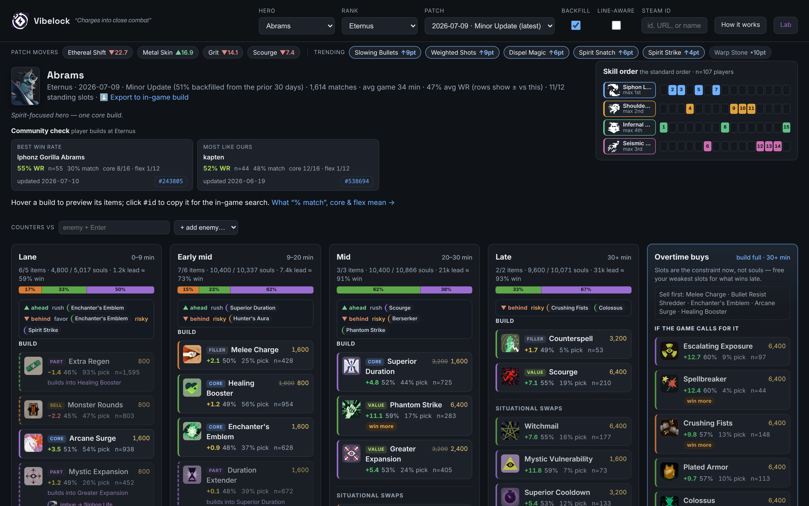

<div align="center">

# Vibelock

**Data-driven item builds for [Deadlock](https://store.steampowered.com/app/1422450/Deadlock/).**

Pick a hero and a rank. Get a phased, annotated build with the numbers behind every choice.

**[Open the app →](https://pabulum.github.io/vibelock/)**

[](https://github.com/pabulum/vibelock/actions/workflows/ci.yml)
[](https://github.com/pabulum/vibelock/actions/workflows/deploy.yml)
[](LICENSE)



</div>

## Features

- **Phased builds.** Lane → Early mid → Mid → Late, each phase budgeted to the items and souls players of that hero and rank actually spend by then.
- **Every number is shown.** Win rate, pick rate, and sample size on every row, so you can judge a pick instead of trusting it.
- **Core vs situational.** What to buy every game, and the swaps that beat it in the right spot.
- **Counters.** Enter the enemy lineup and the build re-ranks, folding the items that swing each matchup into the phase they belong in.
- **Slot economy.** Tracks which items get sold or built into something bigger, so the standing-slot count is honest.
- **Skill order.** The standard ability order, conditioned on the build you are running.
- **Export to the game.** Writes the build into Deadlock's local build cache, ready to pick in-game.
- **Patch-aware.** Defaults to the newest patch, backfills thin day-one data from the previous window, and tells you how much was borrowed.

No account, no backend, no tracking. It runs entirely in your browser against the public [deadlock-api.com](https://deadlock-api.com).

## Run locally

```bash
npm install
npm run dev      # http://localhost:5173/vibelock/
```

```bash
npm test         # unit + browser smoke tests (once: npx playwright install chromium)
npm run lint
npm run build    # also typechecks
```

## How it works

Most build sites rank items by win rate. The trouble is that an item's win rate largely measures
_when_ it gets bought: expensive items get bought by players who are already winning, so they look
good regardless of what they do. Measured on live data, an item's raw win rate correlates at r ≈ 0.91
with the win probability that already held at the moment of purchase.

Vibelock takes two shots at that problem.

**It builds instead of ranking.** A build is a correlated set of items under a budget, so the top-N
items scored independently do not compose into one. Each phase is filled against a real soul budget,
balanced across weapon/vitality/spirit the way players of that hero actually invest, and checked
against measured co-purchase data so that two items which are really an either/or do not both land in
the build.

**It corrects for game state.** Rankings use `adjusted_win_rate`, which standardizes on net worth at
the time of purchase. The **Lab** goes further, scoring items by how far they beat the win
probability their purchase situation already implied — fitted nightly over a rolling 30-day sample of
match timelines.

The full write-up — slot economy, the flex-hero archetype split, patch blending, Bradley-Terry
matchup de-noising, and a frank account of what remains confounded — lives in
**[docs/METHODOLOGY.md](docs/METHODOLOGY.md)**.

## Caveats

Win-rate builds, this one included, still partly measure _who_ buys an item rather than what the item
does: good players buy good items. `adjusted_win_rate` shrinks that effect without erasing it. Treat
the numbers as a strong prior, not as gospel. The Lab's state-adjusted scores and the per-item
comeback / win-more tags are there to show you where the bias bites hardest.

## Contributing

Issues and pull requests are welcome. CI runs lint, tests, and a typechecked build on every pull
request — please keep it green.

## Credits

Data and game assets come from [deadlock-api.com](https://deadlock-api.com) (MIT). Built with React,
TypeScript, and Vite.

## License

[MIT](LICENSE).

Vibelock is an unofficial, fan-made tool. It is not affiliated with, endorsed by, or sponsored by
Valve. Deadlock and all related assets are trademarks of Valve Corporation.
